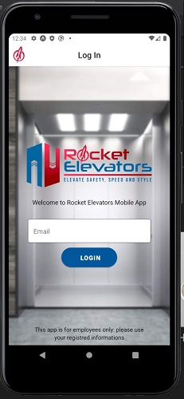
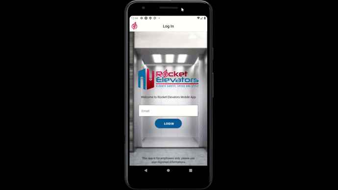

# Rocket Elevators Mobile 

---

## CodeBoxx Odissey - CodeBoxx Odissey - Week 14 - Mobile development

---

Project by:

```ssh
- Cristiane Santiago
```

---

🚀The Mobile application will allow teams in the field to interact with the Rocket Elevators information system, only emplyee can access to the sytem.
The development of the native app is possible thanks to the implementation of the Rocket Elevators RestAPI

## 📌 Test:

- Link to the public project : https://expo.io/@cris.s.santiago/projects/Rocket-Elevators-Mobile you can scan the QR code and start testing

- The access to the project builds will be provided privately

<table><tbody>
    <tr>
    <td>1</td>
    <td>nicolas.genest@codeboxx.biz</td>
</tr>
<tr>
    <td>2</td>
    <td>mathieu.houde@codeboxx.biz</td>
</tr>
<tr>
    <td>3</td>
    <td>employee@employee.com</td>
</tr>
</tbody>
</table>

---

## Preview




---

## 📌 How to use?

Run project on WEB/ iOS / Android.

```js

 expo start
 //
 npm start

```

When you run, Expo CLI starts.

---

## Implementation

- React native
- Expo Cli
- Android Studio
- Rest API: https://rocket-elevator-mobile.herokuapp.com

---

## Reference:

📚 https://expo.io/

📚 https://reactnative.dev/


---

# Rocket Elevators Rest API

---
